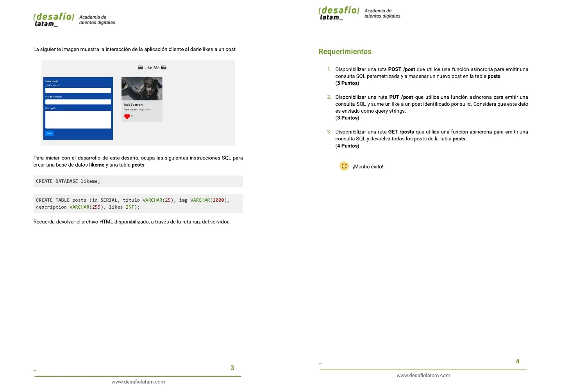

# Resolución Desafío - Like Me

Repositorio con el código solución al desafío 5 del módulo 7 llamado **Acceso a datos en aplicaciones Node** de la beca otorgada por Talento Digital Para Chile **Desarrollo de aplicaciones Full Stack Javascript Trainee** dictada por Desafío Latam.

## Tabla de Contenidos

- [Resolución Desafío - Like Me](#resolución-desafío---like-me)
  - [Tabla de Contenidos](#tabla-de-contenidos)
  - [Requisitos](#requisitos)
  - [Soluciones](#soluciones)
    - [1. Disponibilizar una ruta POST /post que utilice una función asíncrona para emitir una consulta SQL parametrizada y almacenar un nuevo post en la tabla posts. (3 Puntos)](#1-disponibilizar-una-ruta-post-post-que-utilice-una-función-asíncrona-para-emitir-una-consulta-sql-parametrizada-y-almacenar-un-nuevo-post-en-la-tabla-posts-3-puntos)
      - [1.1 Estado Inicial](#11-estado-inicial)
      - [1.2 Creación exitosa de nuevo post Front End](#12-creación-exitosa-de-nuevo-post-front-end)
      - [1.3 Creación exitosa de nuevo post Back End](#13-creación-exitosa-de-nuevo-post-back-end)
    - [2. Disponibilizar una ruta PUT /post que utilice una función asíncrona para emitir una consulta SQL y sume un like a un post identificado por su id. Considera que este dato es enviado como query strings. (3 Puntos)](#2-disponibilizar-una-ruta-put-post-que-utilice-una-función-asíncrona-para-emitir-una-consulta-sql-y-sume-un-like-a-un-post-identificado-por-su-id-considera-que-este-dato-es-enviado-como-query-strings-3-puntos)
      - [2.1. Adición Exitosa de Like Front End](#21-adición-exitosa-de-like-front-end)
      - [2.2. Adición Exitosa de Like Back End](#22-adición-exitosa-de-like-back-end)
      - [2.3 Agregación de Múltiples Likes](#23-agregación-de-múltiples-likes)
    - [3. Disponibilizar una ruta GET /posts que utilice una función asíncrona para emitir una consulta SQL y devuelva todos los posts de la tabla posts. (4 Puntos)](#3-disponibilizar-una-ruta-get-posts-que-utilice-una-función-asíncrona-para-emitir-una-consulta-sql-y-devuelva-todos-los-posts-de-la-tabla-posts-4-puntos)
      - [3.1 Ruta API](#31-ruta-api)

## Requisitos




## Soluciones

### 1. Disponibilizar una ruta POST /post que utilice una función asíncrona para emitir una consulta SQL parametrizada y almacenar un nuevo post en la tabla posts. (3 Puntos)

He creado la siguiente ruta que cumple lo solicitado:

```js
router.post("/post", addPost);
```

La cual hace uso de la siguiente función asíncrona **addPost**:

```js
export async function addPost(req, res) {
  try {
    const { titulo, img, descripcion } = req.body;
    const data = [titulo, img, descripcion, 0];
    const result = await addPostQuery(data);
    res.status(200).send(result);
  } catch (error) {
    res.status(500).send(error.message);
  }
}
```

La función anterior hace uso de la siguiente función **addPostQuery**:

```js
export async function addPostQuery(datos) {
  try {
    const query = {
      text: "INSERT INTO posts (titulo,img, descripcion, likes) VALUES ($1, $2, $3, $4) returning *",
      values: datos,
    };
    const { rowCount, rows } = await pool.query(query);
    if (rowCount === 0) {
      throw new Error("No se pudo crear el post");
    }
    return rows[0];
  } catch (error) {
    console.log(error.message);
  }
}
```

#### 1.1 Estado Inicial


#### 1.2 Creación exitosa de nuevo post Front End


#### 1.3 Creación exitosa de nuevo post Back End


### 2. Disponibilizar una ruta PUT /post que utilice una función asíncrona para emitir una consulta SQL y sume un like a un post identificado por su id. Considera que este dato es enviado como query strings. (3 Puntos)

He creado la siguiente función que cumple lo solicitado:

```js
router.put("/post", editPostLike);
```

Dicha ruta hace uso de la siguiente función **editPostLike**:

```js
export async function editPostLike(req, res) {
  try {
    const { id } = req.query;
    const result = await editPostLikeQuery(id);
    res.status(200).send(result);
  } catch (error) {
    res.status(500).send(error.message);
  }
}
```

La cual utiliza la siguiente función para editar el número de likes:

```js
export async function editPostLikeQuery(id) {
  try {
    const query = {
      text: "UPDATE posts SET likes =likes+ 1 WHERE id = $1 returning *",
      values: [id],
    };
    const { rowCount, rows } = await pool.query(query);
    if (rowCount === 0) {
      throw new Error("No se pudo dar like");
    }
    return rows[0];
  } catch (error) {
    console.log(error.message);
  }
}
```

#### 2.1. Adición Exitosa de Like Front End


#### 2.2. Adición Exitosa de Like Back End


#### 2.3 Agregación de Múltiples Likes


### 3. Disponibilizar una ruta GET /posts que utilice una función asíncrona para emitir una consulta SQL y devuelva todos los posts de la tabla posts. (4 Puntos)

He creado la siguiente ruta:

```js
router.get("/posts", getPosts);
```

La cual hace uso de la siguiente función **getPosts**:

```js
export async function getPosts(req, res) {
  try {
    const rows = await getPostsQuery();
    res.status(200).json(rows);
  } catch (error) {
    res.status(500).send(error.message);
  }
}
```

La que a su vez hace uso de la siguiente función **getPostsQuery**:

```js
export async function getPostsQuery() {
  try {
    const { rowCount, rows } = await pool.query(`SELECT * FROM posts`);
    if (rowCount === 0) {
      throw new Error("No hay datos");
    }

    return rows;
  } catch (error) {
    console.log(error.message);
  }
}
```

#### 3.1 Ruta API


